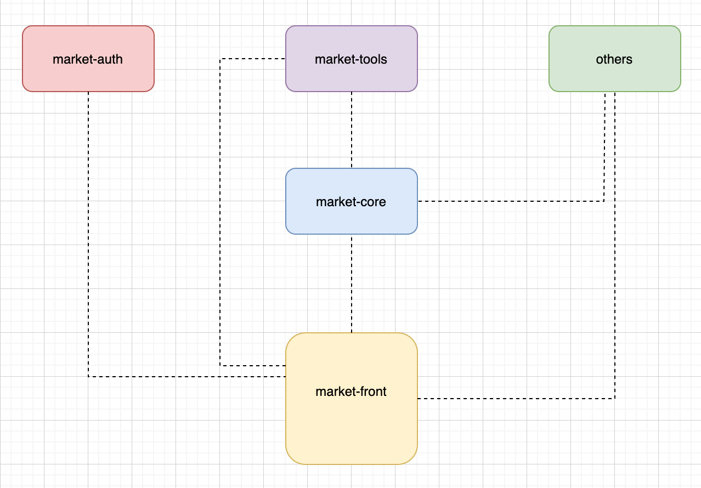

# market-core
==========
Table of contents
---
1. [Architecture](#architecture)
2. [Git Repositories](#git-repositories)

Architecture
----
 

Git Repositories
----
###Introduction

The following list explains the list of available projects :

* [market-front](https://github.com/tbourouis/market-front.git)

> User interface (angular)

* [market-core](https://github.com/tbourouis/market-core.git)

> The main project , used to dispatch calls.

* [market-tools](https://github.com/tbourouis/market-tools.git)

> A sample project to group some utility functions.

* [market-auth](https://github.com/tbourouis/market-auth.git)

> Project to manage authentication/authorizations via [JSON Web Token](http://www.jwt.io)

### Get the project

1. Open any Git client.
2. Clone the projects.
    *   `git clone https://github.com/tbourouis/market-front.git`
    *   `git clone https://github.com/tbourouis/market-core.git`
    *   `git clone https://github.com/tbourouis/market-auth.git`
    *   `git clone https://github.com/tbourouis/market-tools.git`